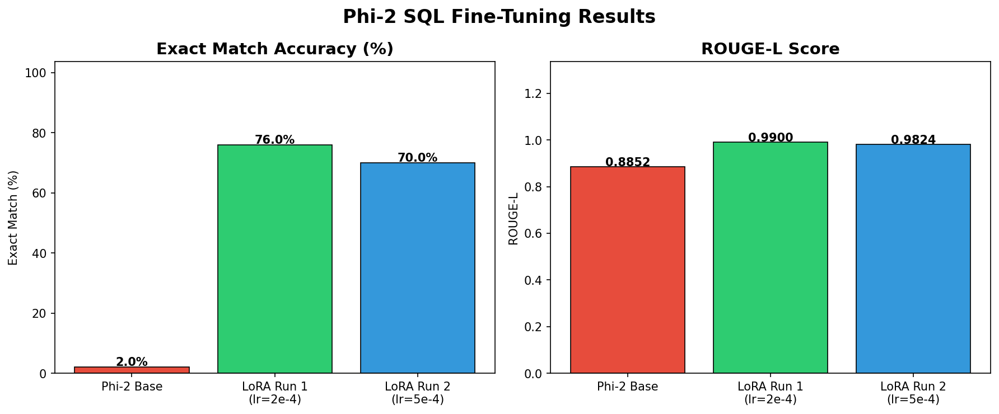

# LLM Fine-Tuning + Evaluation Pipeline

Fine-tuning `microsoft/phi-2` on SQL generation using QLoRA, with a full evaluation harness comparing base vs fine-tuned performance.

**Result: 2% → 76% exact match (+74 percentage points)**

## Project Overview

| Item | Detail |
|---|---|
| Base model | [microsoft/phi-2](https://huggingface.co/microsoft/phi-2) |
| Dataset | [b-mc2/sql-create-context](https://huggingface.co/datasets/b-mc2/sql-create-context) |
| Method | QLoRA (4-bit NF4 + LoRA r=16) |
| Hardware | Kaggle T4 x2 (free tier) |
| Fine-tuned adapter | [antony-bryan-3D2Y/phi2-sql-lora](https://huggingface.co/antony-bryan-3D2Y/phi2-sql-lora) |
| W&B training runs | [phi2-sql-finetune](https://wandb.ai/antonybryan2-00-anthropic/phi2-sql-finetune) |

## Results

| Model | Exact Match | ROUGE-L | Δ vs Base |
|---|---|---|---|
| Phi-2 Base | 2.0% | 0.886 | — |
| Phi-2 + LoRA Run 1 (lr=2e-4) | **76.0%** | **0.9903** | **+74pp** |
| Phi-2 + LoRA Run 2 (lr=5e-4) | 70.0% | 0.9825 | +68pp |

Evaluated on 50 held-out samples from sql-create-context (seed=42).

## Qualitative Analysis

Fine-tuning produced zero regressions — every query the base model answered correctly was also answered correctly by the fine-tuned model. Key improvements:

- **Column selection:** Model learned to select only the requested column (`SELECT points FROM`) instead of `SELECT *`
- **String quoting:** Consistent double-quote convention matching training data, vs base model's inconsistent single quotes
- **Multi-condition WHERE:** Correctly handles complex AND conditions across multiple columns
- **No hallucination:** Base model frequently appended lengthy natural language explanations after the SQL query. The fine-tuned model stops cleanly at the SQL statement every time.

**Example:**

Question: Who is the h.h. principal with Jim Haught as h.s. principal?
Base:   SELECT hh_principal, wr_principal, hs_principal, maplemere_principal
FT:     SELECT hh_principal FROM table_name_55 WHERE hs_principal = "jim haught" ...
GT:     SELECT hh_principal FROM table_name_55 WHERE hs_principal = "jim haught" ...

## Repo Structure

llm-finetune-eval/
├── README.md
├── requirements.txt
├── notebooks/
│   └── phi2-sql-finetune.ipynb    # Full pipeline: baseline → training → evaluation
├── results/
│   ├── baseline_results.csv       # Base model predictions (2% EM)
│   ├── predictions_base.csv       # Base model on 50-sample test set
│   ├── predictions_run1.csv       # Run 1 predictions (76% EM)
│   ├── predictions_run2.csv       # Run 2 predictions (70% EM)
│   ├── results_summary.csv        # Final comparison table
│   └── charts/
│       └── results_comparison.png # Bar chart: EM and ROUGE-L comparison

## Training Details

| Parameter | Value |
|---|---|
| LoRA rank | 16 |
| LoRA alpha | 32 |
| Target modules | q_proj, v_proj |
| Quantization | 4-bit NF4 |
| Training samples | 20,000 |
| Epochs | 2 |
| Effective batch size | 16 |
| Learning rate (Run 1) | 2e-4 |
| Learning rate (Run 2) | 5e-4 |
| Max sequence length | 256 |
| Training time | ~7 hours per run |
| Optimizer | paged_adamw_8bit |

## Environment

transformers==5.0.0
peft==0.18.1
trl==1.2.0
bitsandbytes==0.49.2

Trained on Kaggle free tier (T4 x2, CUDA 12.8, Python 3.12).
